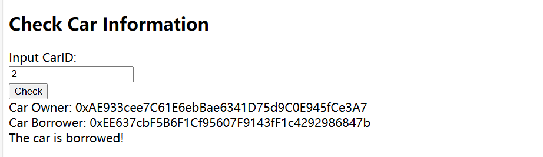
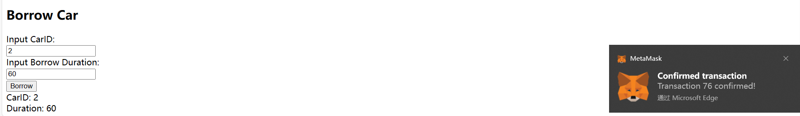

# ZJU-block chain

## 如何运行

1. 在本地启动ganache应用。

2. 在 `./contracts` 中安装需要的依赖，运行如下的命令：
    ```bash
    npm install --save-dev hardhat
    ```
3. 在 `./contracts` 中编译合约，运行如下的命令：
    ```bash
    npx hardhat compile
    ```
    ```bash
    npm install @openzeppelin/contracts
    ```
4. 将ABI文件复制到`./frontend/src/utils/abis`中

5. 在`./contracts`中运行如下的命令：
    ```bash
    npx hardhat run ./scripts/deploy.ts --network ganache
    ```
6. 在 `./frontend` 中安装需要的依赖，运行如下的命令：
    ```bash
    npm install web3
    ```
    ```bash
    npm install react react-dom
    ```
7. 在 `contracts.ts` 中配置ganache网络的参数

8. 在 `./frontend` 中启动前端程序，运行如下的命令：
    ```bash
    npm run start
    ```

## 功能实现分析

1. 汽车NFT集合的发行通过用户“上传汽车”实现，用户手动点击“Upload”按钮，触发NFT生成函数，生成一个汽车NFT，并按照自然数顺序编号，指定汽车的owner为该用户，borrower初始化为address（0），untilTime初始化为0；

2. 查询汽车列表功能：由于NFT数量不大，查询列表功能采用遍历算法，通过carTokenId（即汽车编号）遍历所有NFT，将NFT中owner地址与当前命令发出用户的地址一致取出，将其编号计入提前定义好的数组之中，最后将数组输出，即为该用户拥有的汽车列表。

3. 查询尚未借出的汽车列表功能：与上一步类似，只要将NFT中owner地址与当前命令发出用户的地址一致且borrower地址为0的取出，将其编号计入提前定义好的数组之中，最后将数组输出，即为该用户尚未借出的汽车列表。

4. 查询汽车信息功能：在输入框中输入汽车编号（carTokenId），即可找到该汽车所对应的NFT，并输出owner地址和borrower地址，若borrower地址为0，则输出提示信息“The car is available!”，提示用户该车可借用；若borrower地址不为0，则输出提示信息“The car has been borrowed!”，提示用户该车已被借用。

5. 借用功能：输入汽车编号（carTokenId）和借用时长（duration），若该汽车NFT还在借用状态（borrower地址不为0），则会出现报错信息，交易也会失败；若该汽车NFT没有被借用，则将当前用户的地址赋给该车的borrower地址，到期时间（untilTime）=当前时间（block.timestamp）+借用时长（duration），作为判断借用状态的标志。当untilTime<=block.timestamp时，将borrower和untilTime置0，恢复空闲状态。

6. 由于第一次写前端代码，页面较为简陋，有些地方交互不方便，还可以进一步改进，算法还可优化。

## 项目运行截图

1. 连接切换账户：
)

2. 上传汽车功能：


3. 查询列表功能：


````markdown
4. 查询汽车信息（可借用）

```

````markdown
5. 查询汽车信息（被借用）

```

````markdown
6. 借用功能（借用成功）

```

````markdown
7. 借用功能（借用成功）

```


## 参考内容

- 课程的参考Demo见：[DEMOs](https://github.com/LBruyne/blockchain-course-demos)。

- ERC-4907 [参考实现](https://eips.ethereum.org/EIPS/eip-4907)

如果有其它参考的内容，也请在这里陈列。
